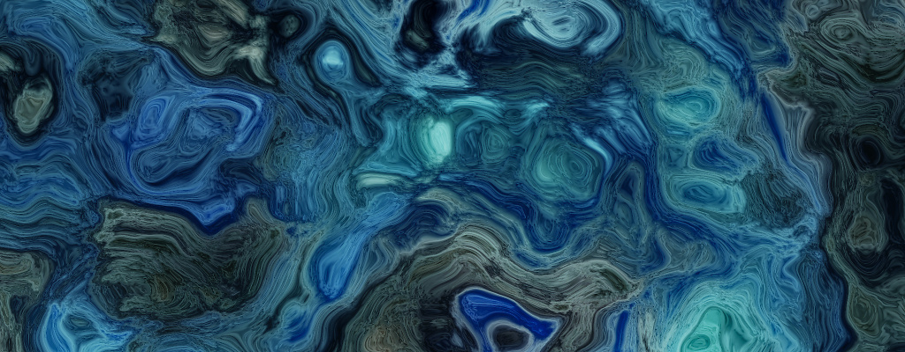
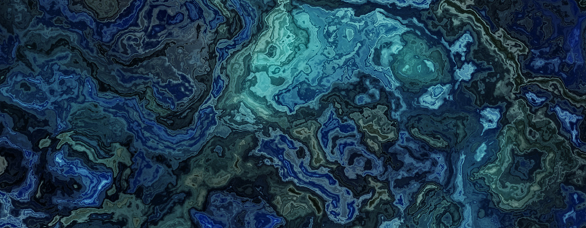

# bg-generation-domain-warping

Command line that generate "beautiful" image based on noise generation. The idea is inspired by this [blog post](https://iquilezles.org/articles/warp/)

- Github : [https://github.com/edmBernard/bg-generation-domain-warping](https://github.com/edmBernard/bg-generation-domain-warping)




## Generated command

- `bg-generation`

## Dependencies

We use :
- Zig : 0.15.1
- [stb_image](https://github.com/nothings/stb) to save result as images


### Compilation

```bash
zig build
zig build --release=fast run -- <filename_without_ext> <width> <height> <variant>
```

## Disclaimer

It's a toy project. And I completly suck at Zig. So if you spot error, improvement comments are welcome.
