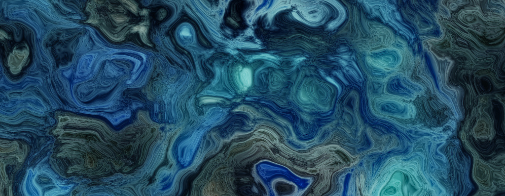
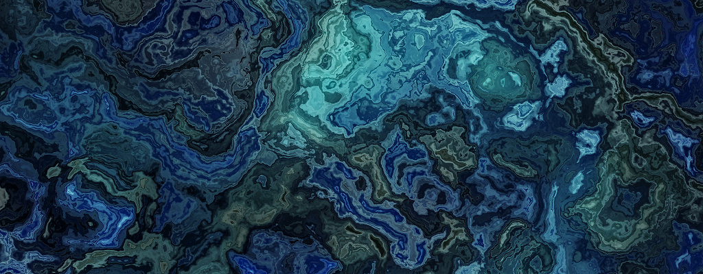

# bg-generation-domain-warping

Command line that generate "beautiful" image based on noise generation. The idea is inspired by this [blog post](https://iquilezles.org/articles/warp/)

- Github : [https://github.com/edmBernard/bg-generation-domain-warping](https://github.com/edmBernard/bg-generation-domain-warping)




## Usage

### Single image

```bash
zig build --release=fast run -- <filename_without_ext> <width> <height> <variant>
```

This generates a JPEG image. `variant` is 1, 2, or 3.

### Video

Raw RGB frames are written to stdout, pipe them to ffmpeg to encode a video:

```bash
zig build --release=fast run -- video <width> <height> <variant> <fps> <total_frames> | \
  ffmpeg -f rawvideo -pixel_format rgb24 -video_size <width>x<height> \
  -framerate <fps> -i - -c:v libx264 -pix_fmt yuv420p output.mp4
```

For example, a 10-second video at 30fps:

```bash
zig build --release=fast run -- video 1920 1080 1 30 300 | \
  ffmpeg -f rawvideo -pixel_format rgb24 -video_size 1920x1080 \
  -framerate 30 -i - -c:v libx264 -pix_fmt yuv420p output.mp4
```

## Dependencies

We use :
- Zig : 0.15.2
- [zpp](https://github.com/edmBernard/zpp) :  SIMD low level processing library.
- [stb_image](https://github.com/nothings/stb) to save result as images.

### Compilation

```bash
zig build
```

## Disclaimer

It's a toy project. And I completly suck at Zig. So if you spot error, improvement comments are welcome.
